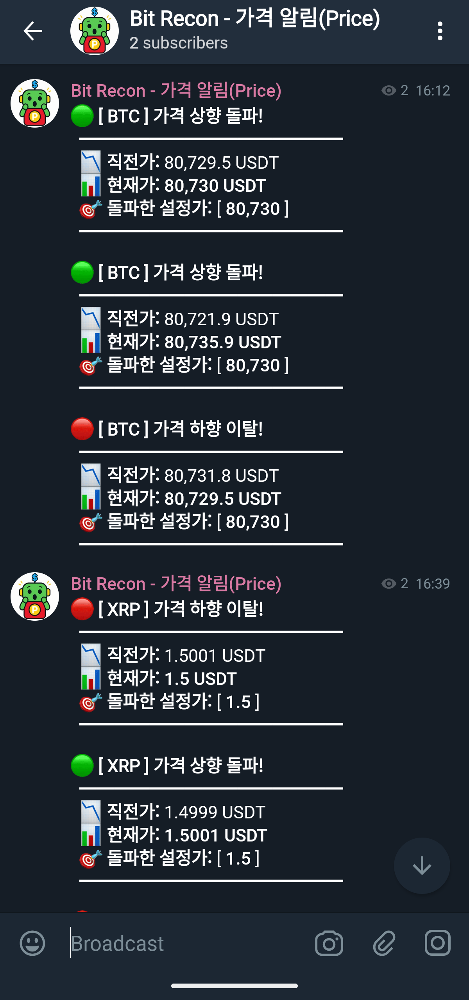
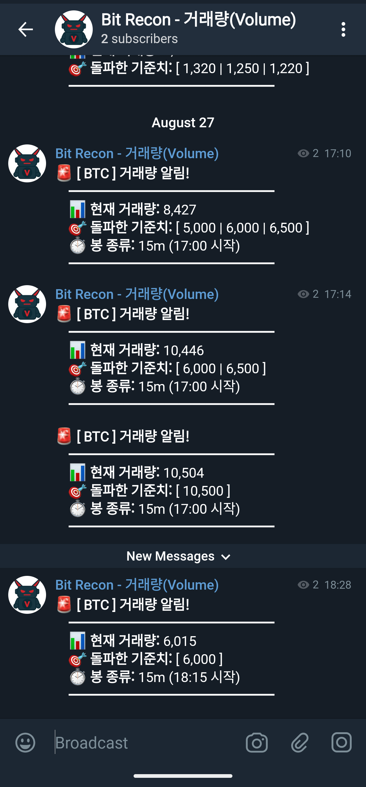
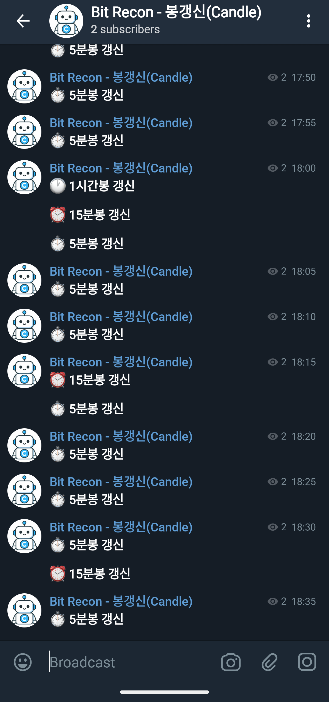

# NestJS Crypto Telegram Alert

**한국어** | [English](./README.en.md)

```text
┌──────────────────────────────────────────┐
│   NESTJS · BINANCE FUTURES · TELEGRAM     │
│         Event-Driven Alert Server         │
└──────────────────────────────────────────┘
```

바이낸스 선물(Binance Futures) 실시간 kline 데이터를 웹소켓으로 구독해, 가격/거래량/캔들 갱신 조건을 만족하면 텔레그램으로 알림을 보내는 NestJS 서버입니다.

`EventEmitter2` 기반 이벤트 구독 구조와, `data/coins.json` 설정 파일 하나로 알림 종류·대상 코인·억제 조건(쿨다운/수면시간)을 코드 수정 없이 제어하는 구조로 만들었습니다.

> **Project goal**
>
> - 가격(변동성)·거래량(누적)처럼 성질이 다른 데이터에 각각 맞는 중복 방지 전략 적용
> - 대상 코인, 알림 on/off를 `coins.json` 하나로 관리

> **Project context**
>
> - 개인 용도로 제작했다가 나중에 완성도를 높인 프로젝트
> - AI 도구는 Claude 위주로 개발 — 서로 피드백을 주고받으며 코드를 정비하는 방식으로 진행

---

## 실행 화면

<table>
  <tr>
    <td align="center">
      <br>
      가격 알림
    </td>
    <td align="center">
      <br>
      거래량 알림
    </td>
    <td align="center">
      <br>
      캔들 갱신 알림
    </td>
  </tr>
</table>

---

## Tech Stack

| Category | Technology |
| --- | --- |
| Runtime | Node.js |
| Framework | NestJS 11 (TypeScript) |
| 실시간 통신 | `ws` (바이낸스 선물 웹소켓 직접 연결) |
| 이벤트 처리 | `@nestjs/event-emitter` |
| 스케줄링 | `@nestjs/schedule` (`@Cron`) |
| 알림 발송 | `node-telegram-bot-api` |
| 숫자 포맷 | `numeral` |
| 설정 관리 | `@nestjs/config` (`.env`) + `data/coins.json` |
| 패키지 매니저 | pnpm |
| 테스트 | Jest |

---

## Architecture

```text
Binance Futures WebSocket
        │
        ▼
BinanceWebSocketService
        │  kline.update (EventEmitter2)
        │
        ├─────────────┬────────────────────┐
        ▼             ▼                    ▼
PriceAlertService   VolumeAlertService   CandleAlertService
        │             │                  (kline.update와 무관, 별도 @Cron)
        └─────────────┴───────┬──────────────┘
                              ▼
                      TelegramService
```

위 서비스들은 모두 `CoinConfigService`(`data/coins.json`)로부터 설정을 공급받습니다.

### 알림 흐름

1. 바이낸스 웹소켓에서 kline 데이터가 들어오면 `kline.update` 이벤트 하나로 발행
2. `PriceAlertService`, `VolumeAlertService`가 같은 이벤트를 각자 구독해서 독립적으로 판정
3. 조건을 만족하면 `TelegramService`를 통해 알림 타입에 맞는 채널로 발송
4. `CandleAlertService`는 이벤트와 무관하게 `@Cron` 스케줄로 캔들 갱신 시각에 별도 알림

---

## 디렉터리 및 파일 구조

```text
.
├── data/
│   └── coins.json                       # 코인별 알림 설정 + 공통 설정
│
├── docs/
│   ├── DEVELOPMENT.md                   # 설치/실행/환경변수 가이드 (한국어)
│   ├── DEVELOPMENT.en.md                # 설치/실행/환경변수 가이드 (영문)
│   └── images/                          # README용 스크린샷
│       ├── price.png
│       ├── volume.png
│       └── candle.png
│
├── src/
│   ├── main.ts                          # 서버 시작
│   ├── app.module.ts                    # 루트 모듈
│   │
│   ├── common/
│   │   └── interfaces/
│   │       ├── coin-config.interface.ts # coins.json 스키마 타입
│   │       └── candle.interface.ts      # CandleType (캔들 알림 종류)
│   │
│   ├── config/
│   │   ├── config.module.ts             # CoinConfigService 전역 모듈
│   │   ├── coin-config.service.ts       # coins.json 로드 및 설정 조회
│   │   └── coin-config.service.spec.ts
│   │
│   └── features/
│       ├── binance/
│       │   ├── binance.module.ts
│       │   └── services/
│       │       ├── websocket.service.ts     # 바이낸스 kline 웹소켓 연결, kline.update 이벤트 발행
│       │       ├── price-alert.service.ts   # 가격 알림 — 상향/하향 돌파 감지, 쿨다운
│       │       ├── price-alert.service.spec.ts
│       │       ├── volume-alert.service.ts  # 거래량 알림 — threshold 돌파, 캔들 단위 dedup
│       │       ├── volume-alert.service.spec.ts
│       │       ├── candle-alert.service.ts  # 캔들 갱신 알림 (@Cron 스케줄)
│       │       └── candle-alert.service.spec.ts
│       │
│       └── telegram/
│           ├── telegram.module.ts
│           ├── services/
│           │   ├── telegram.service.ts       # 텔레그램 발송 + 메시지 포맷
│           │   └── telegram.service.spec.ts
│           └── interfaces/telegram-message.interface.ts
│
├── package.json
├── nest-cli.json
├── tsconfig.json
├── README.md                            # 한국어 (기본)
└── README.en.md                         # 영문
```

---

## 특징

- [1. 이벤트 기반 아키텍처](#1-이벤트-기반-아키텍처)
- [2. 설정 기반 알림 제어](#2-설정-기반-알림-제어)
- [3. 가격 vs 거래량 — 서로 다른 중복 방지 전략](#3-가격-vs-거래량--서로-다른-중복-방지-전략)
- [4. 텔레그램 멀티채널 발송](#4-텔레그램-멀티채널-발송)

## 1. 이벤트 기반 아키텍처

- 웹소켓 메시지는 `EventEmitter2`로 `kline.update` 이벤트 하나만 발행
- `PriceAlertService` / `VolumeAlertService`가 각자 독립적으로 구독·판정
- 새 알림 추가 시 웹소켓/파싱 코드는 그대로, 구독자만 추가
- `CandleAlertService`는 이 흐름과 무관하게 `@Cron`으로만 동작 (웹소켓 연결 여부와 독립)

## 2. 설정 기반 알림 제어

`data/coins.json` 하나로 코드 수정 없이 알림 동작을 제어합니다.

```json
{
  "coins": [
    {
      "symbol": "BTCUSDT",
      "name": "BTC",
      "volume": { "thresholds": [1000, 1500, 2000], "isActive": true },
      "price": { "thresholds": [65000, 66000, 67000], "isActive": true }
    }
  ],
  "settings": {
    "cooldownSeconds": 15,
    "klineInterval": "15m",
    "candleAlerts": {
      "5m": true, "15m": true, "30m": false,
      "1h": true, "4h": false, "1d": false, "1w": false, "1M": false
    },
    "sleepTime": {
      "isActive": true,
      "startHour": 21,
      "endHour": 6,
      "appliesTo": { "candle": true, "price": false, "volume": false }
    }
  }
}
```

**coins[] 필드**

| 필드 | 설명 |
| --- | --- |
| `symbol` | 바이낸스 선물 심볼 (예: `BTCUSDT`) |
| `name` | 알림 메시지에 표시할 이름 (예: `BTC`) |
| `volume` / `price` | 거래량/가격 알림을 코인별로 독립 on-off + `thresholds`(기준치 목록) |

**settings 필드**

| 필드 | 설명 |
| --- | --- |
| `cooldownSeconds` | 가격 알림 쿨다운 시간(초): 알림 발송 후 해당 시간만큼 알림 발송되지 않음 |
| `klineInterval` | 구독할 바이낸스 캔들 간격 (`1m`~`1M`, 바이낸스 kline interval) |
| `candleAlerts` | 캔들 종류별 갱신 알림 on-off |
| `sleepTime` | 수면시간대(`startHour`~`endHour`) 알림 적용 여부 |

## 3. 가격 vs 거래량 — 서로 다른 중복 방지 전략

> **쿨다운(cooldown)이란**: 한 번 알림을 보낸 뒤 일정 시간 동안 같은 대상의 후속 알림을 보내지 않는 것. 짧은 시간에 반복 발생하는 이벤트의 알림 폭탄을 막기 위한 시간 기반 억제 방식입니다.

두 알림은 데이터 성질이 달라서 중복 방지 설계도 다르게 가져갔습니다.

```text
가격(price)                          거래량(volume)
────────────                         ──────────────
위 ↕ 아래로 오르내림                    캔들 안에서 계속 누적만 됨
같은 threshold를 여러 번 왔다갔다        한 번 넘으면 그 캔들 안에선
  → 알림 폭탄 위험                        다시 안 내려감 → 재돌파 자체가 없음
        │                                       │
        ▼                                       ▼
  시간 기반 쿨다운                        캔들+threshold 기반 dedup(중복 제거)
  (cooldownSeconds 동안 억제)             (같은 캔들에서 이미 보낸 threshold만 추적)
```

## 4. 텔레그램 멀티채널 발송

알림 타입별로 거래량 알림방/가격 알림방/캔들 갱신방을 따로 운영할 수 있습니다.

봇은 텔레그램 [@BotFather](https://t.me/BotFather)에서 `/newbot`으로 생성하고, 발급받은 토큰을 `TELEGRAM_BIT_RECON_BOT_TOKEN`에 설정합니다. 채널/그룹별 챗 ID는 알림을 받을 채널(또는 그룹)에 봇을 추가한 뒤, 해당 채널로 메시지를 한 번 보내고 `https://api.telegram.org/bot<TOKEN>/getUpdates`로 조회해 확인합니다.

```env
TELEGRAM_BIT_RECON_BOT_CHAT_ID_VOLUME=...  # 거래량 알림 전용 텔레그램 봇 챗 ID
TELEGRAM_BIT_RECON_BOT_CHAT_ID_PRICE=...   # 가격 알림 전용 텔레그램 봇 챗 ID
TELEGRAM_BIT_RECON_BOT_CHAT_ID_CANDLE=...  # 캔들 갱신 알림 전용 텔레그램 봇 챗 ID
```

---

## 시작하기

설치, 환경변수, 실행, 테스트 방법은 [docs/DEVELOPMENT.md](./docs/DEVELOPMENT.md)를 참고

---

## License

MIT
